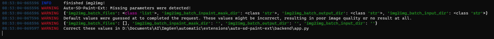

# UI Changelog

## 2023-08-27

Prior versions of auto-sd-paint-ext were incredibly prone to breaking when A1111 or SD.Next updated, due to tapping into internal API calls. This resulted in lots of downtime on the extension, and a version that worked for A1111 would break on SD.Next.

With this update, the extension is far more robust:
- The extension now works for A1111 and SD.Next
- The extension is now forward and backwards compatible, being able to work on older and newer 
- Add a parameter warning system when the backend expects a parameter which the plugin does not have (yet)

> An example image of the new parameter warning system.

## 2023-01-25

- Add ability to disable base size/max size system; Image generated will be same size as selection.

## 2023-01-20

- Removed "Use selection as mask" option; Using the selection to mask generated images is now default behaviour.
- Added "Add transparency mask" option; Choose to mask generated images by adding transparency mask, or directly flatten/crop image.
- Top paintlayer will now be set as active layer when generation is complete.
- New docker that shows a live preview of image generation (if enabled in WebUI).

## 2022-12-28

- Added "Alt Dock Behaviour" under "SD Plugin Config".
  - _Modifies default Krita dock behaviour!_
    - Dragging title bar of docker now drags all stacked/tabbed dockers out instead of just one docker.
    - Dragging the tab now drags the specific docker out instead of only re-arranging the tab.
  - Enables floating stacked/tabbed dockers.
  - Enables subdividing dock areas further.
  - See: <https://doc.qt.io/qt-6/qmainwindow.html#DockOption-enum>
- All generations are added to group layer per batch with generation info.
  - For batches of generations, all but the last image generated is hidden by default.

## 2022-12-20

- **UI Overhaul**: A few miscellaneous changes with some big ones:
  - All tabs are now their own dockers to allow more flexibility in arranging.
    - "Restore Defaults" will make all dockers re-appear and arrange themselves.
  - Progress & number of pending requests now shown.
  - All dropdowns now support searching, useful if your model checkpoint list is really long.

## 2022-12-04

- Add Interrupt button.

## 2022-11-15

- Scripts/features that increase the image size (Simple upscaling, SD upscaling, Outpaint Mk 2, etc) will now expand the canvas when image generation is complete **only if** _there is no active selection_.
  - If there is a selection, the image will be scaled to fit the selection region.
  - Using Ctrl+A to select the entire image is considered an active selection!

## 2022-11-08

- Inpainting is finally 100% fixed! No more weird borders. Blur works properly.
- Inpainting Full Resolution and Mask Blur were deemed obsolete and removed.
  - See <https://github.com/Interpause/auto-sd-paint-ext/wiki/Usage-Guide#inpainting> on better ways to do so.

## 2022-10-31

- Moved base size/max size & some other quick config options based on user feedback.

## 2022-10-25

- Will now save previous tab user was on.
- Fixed seed being truncated to 32-bit int.
- Prevent sending image generation request when cannot connect to backend.

## 2022-10-24

- UI no longer freezes when generating images or network activity like getting backend config
  - Pressing "start xxx" multiple times will queue generation requests on the backend
  - Will not mess with the current selection region or layer when inserting images once done

## 2022-10-21

- No need to manually hide inpainting layer anymore; It will be auto-hidden.
- Color correction can be toggled separately for img2img/inpainting.
- Status bar:
  - In middle of page to be more visible even when scrolling.
  - Warning when using features with no document open.
- Inpaint is now the default tab.
