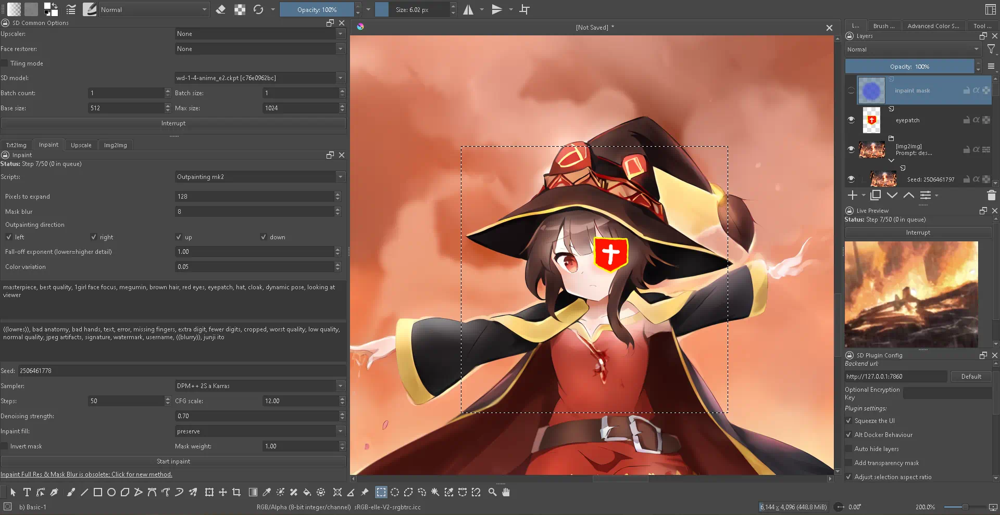

# auto-sd-paint-ext

Formerly known as `auto-sd-krita`.

> Extension for AUTOMATIC1111's webUI with Krita Plugin (other drawing studios soon?)

Why use this?

- Optimized workflow (txt2img, img2img, inpaint, outpaint, upscale) & UI design.
- Only drawing studio plugin that exposes the Script API.
- Easily create/save profiles (prompts, samplers, model, etc used).
- Some of the above isn't actually implemented yet.

## Notice

Refer to <https://github.com/ClashSAN/sd-webui-extension-records> for current working extension & webUI commits and how to switch commits. This is useful when upstream webUI changes break the extension.

Currently stuck on two things with regards to further development:

- Config preset system: <https://github.com/Interpause/auto-sd-paint-ext/tree/feat-config-presets>
  - Currently having issues figuring out how to implement it without needing to overhaul everything.
- Switch to official API

See <https://github.com/Interpause/auto-sd-paint-ext/issues/41> for planned developments.

## Quick Jump

- Full Installation & Workflow Tutorial Video! (Coming Soon...)
- [Installation Guide](https://github.com/Interpause/auto-sd-paint-ext/wiki/Install-Guide)
- [Usage Guide](https://github.com/Interpause/auto-sd-paint-ext/wiki/Usage-Guide)
  - [Step by Step Guide to Better Inpainting](https://github.com/Interpause/auto-sd-paint-ext/wiki/Usage-Guide#inpainting-step-by-step)
- [Update Guide](https://github.com/Interpause/auto-sd-paint-ext/wiki/Update-Guide)
- [Features](https://github.com/Interpause/auto-sd-paint-ext/wiki/Features)
- [TODO](https://github.com/Interpause/auto-sd-paint-ext/wiki/TODO)
- [Contribution Guide](https://github.com/Interpause/auto-sd-paint-ext/wiki/Contribution-Guide)

(Outdated) Usage & Workflow Demo:

### Differences from Video

- All webUI scripts have been tested to work!
  - SD Upscale, Outpainting Mk 2, Img2Img Alt, etc
- Inpainting experience is better
  - Inpaint mask is auto-hidden
  - Better mask blur & inpaint full resolution technique than webUI
- UI no longer freezes during image update
- UI has been improved, takes up less space
- Error messages have been improved

## Breaking Changes

- The URL is different now, so reset "Backend URL" to default under the Config tab.
- It is now an AUTOMATIC1111 extension.
  - Do <https://github.com/Interpause/auto-sd-krita/wiki/Quick-Switch-Using-Existing-AUTOMATIC1111-Install> in reverse for a quick fix.
- `krita_config.yaml` was renamed to `auto-sd-paint-ext-backend.yaml`.

## FAQ

Q: How does the base_size, max_size system work?

A:

It is an alternative to AUTO's highres fix that works for all modes, not just txt2img.

The selection will be resized such that the shorter dimension is base_size. However, if the aforementioned resize causes the longer dimension to exceed max_size, the shorter dimension will be resized to less than base_size. Setting base_size and max_size higher can be used to generate higher resolution images (along with their issues), essentially **disabling the system**, _though it might make sense for img2img mode_.

This is actually smarter than the builtin highres fix + firstphase width/height system. Thank the original plugin writer, @sddebz, for writing this.

Q: Outpainting tab?

A:
While the outpainting tab is still WIP, the outpainting scripts (under img2img tab) works perfectly fine! Alternatively, if you want more control over outpainting, you can:

1. Expand the canvas
2. Scribble in the newly added blank area
3. img2img on the blank area + some of the image

Q: Is the model loaded into memory twice?

A: No, it shares the same backend. Both the Krita plugin and webUI can be used concurrently.

Q: How can you commit to updating regularly?

A: It is easy for me.

Q: Will it work with other Krita plugin backends?

A: Unfortunately no, all plugins so far have different APIs. The official API is coming soon though...

## UI Changelog

See [CHANGELOG.md](./CHANGELOG.md) for the full changelog.

### 2023-01-20

- Removed "Use selection as mask" option; Using the selection to mask generated images is now default behaviour.
- Added "Add transparency mask" option; Choose to mask generated images by adding transparency mask, or directly flatten/crop image.
- Top paintlayer will now be set as active layer when generation is complete.
- New docker that shows a live preview of image generation (if enabled in WebUI).

### 2022-12-28

- Added "Alt Dock Behaviour" under "SD Plugin Config".
  - _Modifies default Krita dock behaviour!_
    - Dragging title bar of docker now drags all stacked/tabbed dockers out instead of just one docker.
    - Dragging the tab now drags the specific docker out instead of only re-arranging the tab.
  - Enables floating stacked/tabbed dockers.
  - Enables subdividing dock areas further.
  - See: <https://doc.qt.io/qt-6/qmainwindow.html#DockOption-enum>
- All generations are added to group layer per batch with generation info.
  - For batches of generations, all but the last image generated is hidden by default.

### 2022-12-20

- **UI Overhaul**: A few miscellaneous changes with some big ones:
  - All tabs are now their own dockers to allow more flexibility in arranging.
    - "Restore Defaults" will make all dockers re-appear and arrange themselves.
  - Progress & number of pending requests now shown.
  - All dropdowns now support searching, useful if your model checkpoint list is really long.

### 2022-12-04

- Add Interrupt button.

### 2022-11-15

- Scripts/features that increase the image size (Simple upscaling, SD upscaling, Outpaint Mk 2, etc) will now expand the canvas when image generation is complete **only if** _there is no active selection_.
  - If there is a selection, the image will be scaled to fit the selection region.
  - Using Ctrl+A to select the entire image is considered an active selection!

### 2022-11-08

- Inpainting is finally 100% fixed! No more weird borders. Blur works properly.
- Inpainting Full Resolution and Mask Blur were deemed obsolete and removed.
  - See <https://github.com/Interpause/auto-sd-paint-ext/wiki/Usage-Guide#inpainting> on better ways to do so.

## Credits

- [@sddebz](https://github.com/sddebz) for writing the original backend API and Krita plugin while keeping the Gradio webUI functionality intact.

## License

MIT for the Krita Plugin backend server & frontend plugin. Code has been nearly completely rewritten compared to original plugin by now.
