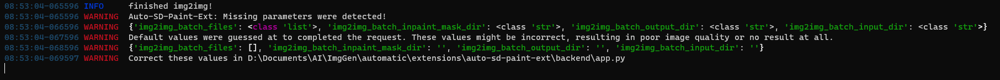

# auto-sd-krita-ext-xl

Forked from https://github.com/Interpause/auto-sd-paint-ext

> Extension for AUTOMATIC1111's webUI **and** SD.Next with Krita Plugin

## Update resilient!

This update should make the extension a lot more flexible in terms of which version of A1111 or SD.Next you can use! If it doesn't work with your version, open an issue and we'll look into it. 

## Why use this?

- Optimized workflow (txt2img, img2img, inpaint, upscale) & UI design.
- Only drawing studio plugin that exposes the Script API.

## Quick Jump

 > Please refer to the original fork's wiki for information while I remake these sections in the fork
- Full Installation & Workflow Tutorial Video! (Coming Soon...)
- [Installation Guide](https://github.com/Interpause/auto-sd-paint-ext/wiki/Install-Guide)
- [Usage Guide](https://github.com/Interpause/auto-sd-paint-ext/wiki/Usage-Guide)
  - [Step by Step Guide to Better Inpainting](https://github.com/Interpause/auto-sd-paint-ext/wiki/Usage-Guide#inpainting-step-by-step)
- [Update Guide](https://github.com/Interpause/auto-sd-paint-ext/wiki/Update-Guide)
- [Features](https://github.com/Interpause/auto-sd-paint-ext/wiki/Features)
- [TODO](https://github.com/Interpause/auto-sd-paint-ext/wiki/TODO)
- [Contribution Guide](https://github.com/Interpause/auto-sd-paint-ext/wiki/Contribution-Guide)

## Community Videos

Thanks [@rexelbartolome](https://github.com/rexelbartolome) for making these videos:

- Installation: <https://youtu.be/eCSIqJ5cmJs>
- Rundown of plugin features: <https://youtu.be/h-BIC9iuPGc>

## FAQ

Q: How does the base_size, max_size system work?

A:

It's an alternative to AUTO's highres fix that works for all modes, not just txt2img.

The selection will be resized such that the shorter dimension is base_size. However, if the aforementioned resize causes the longer dimension to exceed max_size, the shorter dimension will be resized to less than base_size. I recommend not setting base_size lower than 512.

According to Interpause, this is smarter than the builtin highres fix + firstphase width/height system. Thank the original plugin writer, @sddebz, for writing this.

Q: Outpainting tab?

A:
While the outpainting tab is still WIP, the outpainting scripts (under img2img tab) works perfectly fine! Alternatively, if you want more control over outpainting, you can:

1. Expand the canvas
2. Scribble in the newly added blank area
3. img2img on the blank area + some of the image

Q: Is the model loaded into memory twice?

A: No, it shares the same backend. Both the Krita plugin and webUI can be used concurrently.

## UI Changelog

See [CHANGELOG.md](./CHANGELOG.md) for the full changelog.

## 2023-08-27

Prior versions of auto-sd-paint-ext were incredibly prone to breaking when A1111 or SD.Next updated, due to tapping into internal API calls. This resulted in lots of downtime on the extension, and a version that worked for A1111 would break on SD.Next.

With this update, the extension is far more robust:
- The extension now works for A1111 and SD.Next
- The extension is now forward and backwards compatible, being able to work on older and newer 
- Add a parameter warning system when the backend expects a parameter which the plugin does not have (yet)

> An example image of the new parameter warning system.

## 2023-01-25

- Add ability to disable base size/max size system; Image generated will be same size as selection.

### 2023-01-20

- Removed "Use selection as mask" option; Using the selection to mask generated images is now default behaviour.
- Added "Add transparency mask" option; Choose to mask generated images by adding transparency mask, or directly flatten/crop image.
- Top paintlayer will now be set as active layer when generation is complete.
- New docker that shows a live preview of image generation (if enabled in WebUI).

### 2022-12-28

- Added "Alt Dock Behaviour" under "SD Plugin Config".
  - _Modifies default Krita dock behaviour!_
    - Dragging title bar of docker now drags all stacked/tabbed dockers out instead of just one docker.
    - Dragging the tab now drags the specific docker out instead of only re-arranging the tab.
  - Enables floating stacked/tabbed dockers.
  - Enables subdividing dock areas further.
  - See: <https://doc.qt.io/qt-6/qmainwindow.html#DockOption-enum>
- All generations are added to group layer per batch with generation info.
  - For batches of generations, all but the last image generated is hidden by default.

## Credits

- [@sddebz](https://github.com/sddebz) for writing the original backend API and Krita plugin while keeping the Gradio webUI functionality intact.

## License

MIT for the Krita Plugin backend server & frontend plugin. Code has been nearly completely rewritten compared to original plugin by now.
